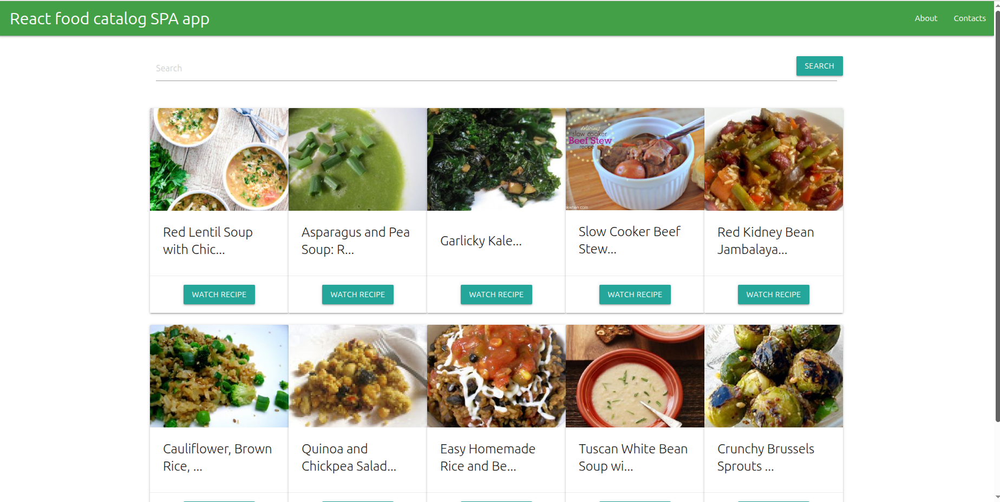

# React Food Catalog

Food recipes catalog built with React.



## Overview

React Food Catalog is a single-page application that allows users to search and browse food recipes through an external API.

The project demonstrates React fundamentals, API integration, state management and dynamic rendering of large datasets.

## Features

### Recipe Search

* Search recipes by keyword
* Dynamic search results
* Instant content updates

### Recipe Catalog

* Display recipe cards
* Recipe preview images
* Recipe titles and descriptions
* Detailed recipe view

### User Experience

* Responsive interface
* SPA architecture
* Dynamic content rendering
* Intuitive navigation

## Technologies

* React
* JavaScript
* HTML5
* CSS3
* REST API

## Technical Highlights

* Functional components
* React Hooks
* API integration
* Asynchronous data loading
* State management
* Dynamic list rendering
* Search functionality

## Installation

```bash
npm install
```

## Run

```bash
npm start
```

## Future Improvements

* TypeScript migration
* Advanced filtering
* Favorites system
* Pagination
* Improved error handling
* User authentication

```
```


